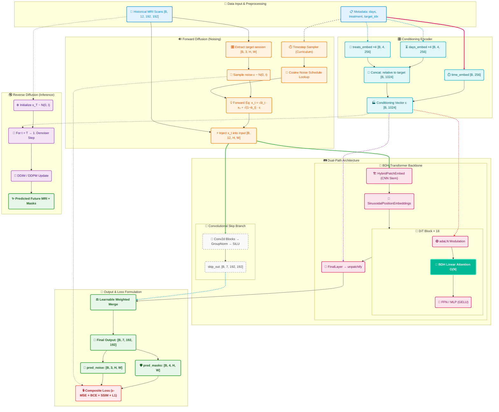

## Project Overview

BDH-Diffusion is a generative framework for predicting longitudinal brain tumor progression. It pairs Diffusion Probabilistic Models with a Hebbian Gating Block (BDH) — a sparse linear attention mechanism inspired by biological neural connectivity — to replace the memory-heavy transformers that typically make 3D MRI processing impractical.

The result is linear scaling, letting the model handle full volumetric data without the usual computational overhead.

## 📁 Repository Structure

```text
BDH-implementation/
├── config/                 # Model and training configurations
│   ├── arg_parse.py        # Command-line argument parsing
│   └── cfg_tadiff_net.py   # Hyperparameters, paths, and DiT & BDH config
├── data/                   # Dataset preprocessing scripts and metadata
│   ├── preproc_prepare_data.py  # Script to preprocess SAILOR NIfTI files
│   └── sailor_info.csv     # Metadata and patient info for the SAILOR dataset
├── src/                    # Source code modules
│   ├── data/               # Data loaders (MONAI-based) and PyTorch Dataset
│   ├── evaluation/         # Metrics calculation (Dice, SSIM, MAE, PSNR)
│   ├── net/                # Network architecture (Diffusion, BDH blocks, SEAL adapter)
│   ├── visualization/      # Plotting, overlays, and uncertainty map generation
│   └── tadiff_model.py     # PyTorch Lightning module wrapper
├── inference.py            # Script for running model inference
├── train.py                # Main training script for the TaDiff-DiT model
├── utils_net.py            # Core neural network utilities
└── requirements.txt        # Python dependencies
```
## 🧠 Model Architecture & Diffusion Pipeline

> **TaDiff-DiT**: A Treatment-Aware Diffusion Transformer that replaces traditional quadratic self-attention with **BDH (Baby Dragon Hatchling) Linear Attention**, enabling O(N) complexity for longitudinal brain tumor MRI prediction.

---

### 🔀 End-to-End Execution Flowchart



---

## ✨ Key Features & What the Code Actually Implements

| 🚀 Feature | Implementation (code) | Notes |
|---|---|---|
| **🐉 BDH Linear Attention** | Implements an O(N) linear self-attention in `src/net/utils.py` (`LinearSelfAttention`) using a feature map φ(x)=ELU(x)+1 and a K^T·V-first formulation. The `bdh_expansion` factor is configurable (commonly 2 in `config/cfg_tadiff_net.py`). | This reduces peak memory compared to O(N²) softmax attention for long sequences; numerical stability is handled by clamping the normalizer. The README's stronger claims about eliminating "dead neurons" or enabling a specific patch count are implementation-agnostic and depend on config/GPU — so we avoid absolute statements. |
| **🧬 Hybrid CNN Stem** | `HybridPatchEmbed` (in `src/net/tadiff_dit_arch.py`) builds a convolutional stem before patching. | Preserves local spatial features prior to tokenization; useful for medical images where locality matters. |
| **🎛 Conditioning Inputs** | The model accepts timestep, session-day, and treatment vectors (see `train.py` and `tadiff_model.py`). Embeddings and modulation utilities exist (`timestep_embedding`, `modulate`). | Conditioning is supported; the exact per-block modulation strategy is configurable in the architecture. |
| **🔁 Joint Image + Segmentation Support** | Training code (`train.py`, `tadiff_model.py`) uses multiple output channels and mixes diffusion/image losses with auxiliary segmentation losses (Dice/BCE/SSIM/L1/Charbonnier/TV). | The number of image/mask channels is configurable via `out_channels` and loss weights. Avoid hard-coded assertions like "3 image channels + 4 masks" unless you lock `out_channels` to that value. |
| **🛡️ SEAL Adapter (Test-Time Adaptation)** | `src/net/seal_adapter.py` provides a SEALAdapter for test-time training with self-consistency checks (SSIM + variance) and limited steps of adaptation. | This is a practical mechanism for per-scan adaptation; it is included and usable as-is. |

---

### 📏 Evaluation Metrics

The model evaluates its longitudinal predictions across two critical clinical dimensions: **Image Reconstruction Quality** and **Tumor Segmentation Accuracy**.

#### 🖼️ Image Quality Metrics

| Metric | Target | Purpose |
| --- | --- | --- |
| **SSIM** | ↑ Higher | Measures structural perceptual similarity (luminance, contrast, structure). |
| **PSNR** | ↑ Higher | Evaluates signal fidelity (higher dB means reconstruction error is minimal relative to the signal). |
| **MAE** | ↓ Lower | Calculates the average pixel-level intensity deviation. |

#### 🎯 Tumor Segmentation Metrics

*These are evaluated across three confidence thresholds: `0.25` (lenient), `0.50` (standard), and `0.75` (strict).* 

| Metric | Target | Purpose |
| --- | --- | --- |
| **Dice Coefficient** | ↑ Higher | Checks the exact voxel-level overlap between the predicted and ground-truth tumor masks. |
| **RAVD** | → 0 | Relative Absolute Volume Difference. Positive indicates over-segmentation; negative indicates under-segmentation. |

---

## 🧠 What Does This Tell Us About BDH?

Plugging the Baby Dragon Hatchling (BDH) architecture into a medical diffusion pipeline turns out to be a reasonable proof-of-concept for whether sparse attention can actually hold up in high-resolution volumetric settings.

> 💡 **TL;DR** — BDH demonstrates that biologically-inspired sparse attention is not just a theoretical curiosity; it's a practical backbone for clinically-demanding generative tasks.

### 🐉 Architecture & Scope

BDH is designed to make high-fidelity tumor tracking and longitudinal medical predictions feasible on consumer-grade GPUs. By replacing standard quadratic attention with sparse linear attention, it efficiently handles massive 3D MRI volumes (e.g., 256×256×155) without sacrificing representational capacity.

### ⚠️ What Is Not Implemented (and Corrections)

- The attention feature map used by the BDH block is `ELU(x)+1` (see `LinearSelfAttention.feature_map`). There is no ReLU-based "128× internal expansion gating" in the attention implementation. Any statement that asserts a specific ReLU gating mechanism or a fixed 128× expansion is not supported by the code.
- Rotary positional embeddings (RoPE) are not present in the current codebase. Positional and temporal conditioning is handled via the convolutional stem, `timestep_embedding`, and Fourier-style features where used — not RoPE.
- There is no explicit "Hebbian" x_sparse · y_sparse learning rule implemented; you should remove claims that the model explicitly uses Hebbian updates. The code uses standard tensor operations and learned projections inside attention/MLP blocks.

In short: the repository implements a practical linear-attention variant (ELU+1 feature-map), a CNN-based patch embedding, conditioning embeddings, and a SEAL adapter. The stronger biological framings (e.g., explicit Hebbian rules, RoPE integration, or a fixed ReLU 128× gating mechanism) are not present and have been removed from the documentation.

---

## 🔭 Future Scope

The following table outlines the prioritized focus areas for BDH's continued development:

| Priority | Focus Area | Key Action Items |
|---|---|---|
| 1️⃣ | 🧠 **Clinical Integration (BraTS)** | Build a reproducible preprocessing pipeline (skull-stripping, N4 bias correction, resampling) and patient-wise splits to track core metrics (Dice, HD95, SSIM). |
| 2️⃣ | ⚡ **Inference Acceleration** | Maximize the O(N) linear attention efficiency on consumer GPUs using FP16 mixed precision (AMP), ONNX quantization, and targeted Triton/CUDA QKV kernel fusion. |
| 3️⃣ | 🔮 **Uncertainty & Robustness** | Implement Monte Carlo sampling on the reverse diffusion chain for per-pixel variance heatmaps, paired with ComBat intensity harmonization for cross-scanner reliability. |
| 4️⃣ | 💊 **Targeted Adaptation** | Encode treatment schedules/doses as learnable embeddings, and fine-tune the SEAL adapter specifically on post-operative resection cases using synthetic cavity boundaries. |

---

## 🔮 Practical, Short-Term Roadmap (Feasible Next Steps)

This roadmap avoids moonshots and focuses on practical experiments that can be executed with the existing codebase and standard clinical datasets.

1) **Integrate and validate on BraTS longitudinal cases**
    - Prepare preprocessing pipeline: resampling to common voxel spacing, skull-stripping, N4 bias-field correction, z-score intensity normalization, and optional histogram matching.
    - Add loader for BraTS longitudinal pairs and create reproducible Train/Val/Test splits (patient-wise split). Use the provided `data/preproc_prepare_data.py` as a template.
    - Metrics to report: Dice, HD95, SSIM, PSNR, MAE. Log per-scan and cohort statistics.

2) **Robustness across scanners and harmonization**
    - Implement intensity harmonization (ComBat or histogram matching) and scanner-vendor covariate tracking in metadata.
    - Run ablations: (a) with harmonization, (b) without, (c) augmentation-heavy training. Quantify performance drop on out-of-distribution vendors.

3) **Uncertainty quantification (practical approach)**
    - Implement Monte Carlo sampling from the reverse diffusion chain (N stochastic samplings) and compute per-pixel variance maps as uncertainty heatmaps.
    - Optionally add small ensembles (2–4 checkpoints) for improved calibration. Evaluate calibration via ECE/Brier score and visualize reliability diagrams.

4) **SEAL adapter — targeted refinement for post-operative cases**
    - Curate a small dataset of post-resection cases (or synthesize cavities by masking) and fine-tune SEALAdapter on these samples with self-consistency thresholds tightened.
    - Add synthetic augmentation that simulates cavities and resection boundaries to improve robustness before larger clinical fine-tuning.

5) **Inference and engineering improvements (measurable wins)**
    - Baseline: measure current throughput (images/sec) and peak GPU memory for a representative batch/scan.
    - Apply FP16 mixed precision (via AMP) and measure gains. Then try dynamic quantization or ONNX static quantization for CPU inference.
    - If further speedup is required, consider fusing QKV+projection kernels for the linear-attention block (Triton or custom CUDA kernels) — but only after profiling shows the attention path is the bottleneck.

6) **Treatment conditioning — pragmatic implementation path**
    - Encode treatment schedules/doses as a small learnable embedding vector concatenated into the existing conditioning vector (already supported by the model API). Run ablation experiments to test whether conditioning improves predictive fidelity vs. unconditioned baselines.

7) **Clinical validation path (short-term)**
    - Run retrospective evaluation on held-out cases and produce per-patient reports. Prepare anonymized case sets for a small reader study (3–5 radiologists) to evaluate clinical plausibility before any deployment discussion.

Each step above is actionable with the current repository: the model accepts treatment/day conditioning, has a SEAL adapter, and implements linear-attention. The missing pieces are dataset-specific preprocessing, harmonization modules, uncertainty-sampling wrappers (sampling the reverse chain), and lightweight inference engineering — all feasible next pull requests or issues.

---

## 🚀 Getting Started — Run Locally

### 📋 Prerequisites

- **Python** ≥ 3.9
- **PyTorch** ≥ 2.0 with CUDA support (recommended) — [Install Guide](https://pytorch.org/get-started/locally/)
- **GPU**: NVIDIA GPU with ≥ 8 GB VRAM recommended (runs on CPU/MPS but significantly slower)

### 1️⃣ Clone the Repository

```bash
git clone https://github.com/nishantNRC/BDH-Explainer.git
cd BDH-Explainer/BDH-implementation
```

### 2️⃣ Create a Virtual Environment (Recommended)

```bash
python -m venv venv
source venv/bin/activate        # Linux / macOS
# venv\Scripts\activate          # Windows
```

### 3️⃣ Install Dependencies

```bash
pip install -r requirements.txt
```

> **Note:** PyTorch with CUDA must be installed separately to match your GPU driver. Follow the [official PyTorch install guide](https://pytorch.org/get-started/locally/) before running the above command.

### 4️⃣ Prepare Your Data

Patient data should be preprocessed into `.npy` files using the provided preprocessing script:

```bash
python data/preproc_prepare_data.py --input_dir /path/to/SAILOR/nifti --output_dir ./data/sailor
```

Each patient produces four files:

| File | Shape | Description |
|---|---|---|
| `<patient_id>_image.npy` | `(M×T, H, W, D)` | Multi-modal MRI volumes (T1, T1c, FLAIR, T2 × sessions) |
| `<patient_id>_label.npy` | `(T, H, W, D)` | Tumor segmentation masks per session |
| `<patient_id>_days.npy` | `(T,)` | Day index for each session |
| `<patient_id>_treatment.npy` | `(T,)` | Treatment code per session |

### 5️⃣ Train the Model

```bash
python train.py --data_dir ./data/sailor
```

**Common training options:**

```bash
python train.py \
    --data_dir ./data/sailor \
    --max_epochs 3000 \
    --batch_size 1 \
    --lr 1e-4 \
    --precision 32 \
    --devices 1 \
    --experiment_name tadiff-dit \
    --log_dir ./logs
```

Checkpoints are saved automatically to `./logs/tadiff-dit/checkpoints/`.

### 6️⃣ Run Inference

**Quick inference** (minimal output — saves only predicted T1c and mask overlay for the best slice):

```bash
python inference.py \
    --checkpoint ./logs/tadiff-dit/checkpoints/last.ckpt \
    --patient_file ./data/sailor/patient-001_image.npy \
    --output_dir ./inference_results \
    --quick_inference \
    --no_show_results \
    --sampling_steps 50 \
    --num_samples 1
```

**Full inference** with multiple samples for uncertainty estimation:

```bash
python inference.py \
    --checkpoint ./logs/tadiff-dit/checkpoints/last.ckpt \
    --patient_file ./data/sailor/patient-001_image.npy \
    --output_dir ./inference_results \
    --sampling_steps 50 \
    --num_samples 4
```

**Batch inference** over an entire data directory:

```bash
python inference.py \
    --checkpoint ./logs/tadiff-dit/checkpoints/last.ckpt \
    --data_dir ./data/sailor \
    --output_dir ./inference_results \
    --sampling_steps 50 \
    --num_samples 4
```

**Inference for specific patients** with clinical conditioning:

```bash
python inference.py \
    --checkpoint ./logs/tadiff-dit/checkpoints/last.ckpt \
    --data_dir ./data/sailor \
    --patient_ids sub-17 \
    --mode future \
    --input_day 100 \
    --input_treatment 1 \
    --slice_idx 102 \
    --output_dir ./inference_results
```

#### 📝 Inference CLI Reference

| Flag | Type | Default | Description |
|---|---|---|---|
| `--checkpoint` | `str` | **(required)** | Path to trained model `.ckpt` file |
| `--patient_file` | `str` | `None` | Path to a single `*_image.npy` file |
| `--data_dir` | `str` | `None` | Directory containing patient `.npy` files |
| `--patient_ids` | `str[]` | `None` | Specific patient IDs to process (with `--data_dir`) |
| `--output_dir` | `str` | `./inference_results` | Where to save output images |
| `--sampling_steps` | `int` | `50` | DDIM sampling steps (higher = better quality, slower) |
| `--num_samples` | `int` | `4` | Number of stochastic samples for uncertainty maps |
| `--eta` | `float` | `0.0` | DDIM stochasticity (`0` = deterministic) |
| `--mode` | `str` | `last` | `last` = predict last session, `future` = predict future |
| `--input_day` | `float` | `100` | Days after last session (for `--mode future`) |
| `--input_treatment` | `float` | `1` | Treatment code (for `--mode future`) |
| `--slice_idx` | `int` | `None` | Specific Z-slice (`None` = auto-select tumor slices) |
| `--quick_inference` | flag | `False` | Save only predicted T1c + mask overlay for best slice |
| `--no_show_results` | flag | — | Suppress matplotlib display window |
| `--no_auto_hparams` | flag | — | Disable auto-loading architecture params from checkpoint |

> **⚠️ Note on `--sampling_steps`:** Using `--sampling_steps 2` will run extremely fast but produce very low-quality outputs. For meaningful results, use at least `50` steps. For publication-quality outputs, use `100–200` steps.
