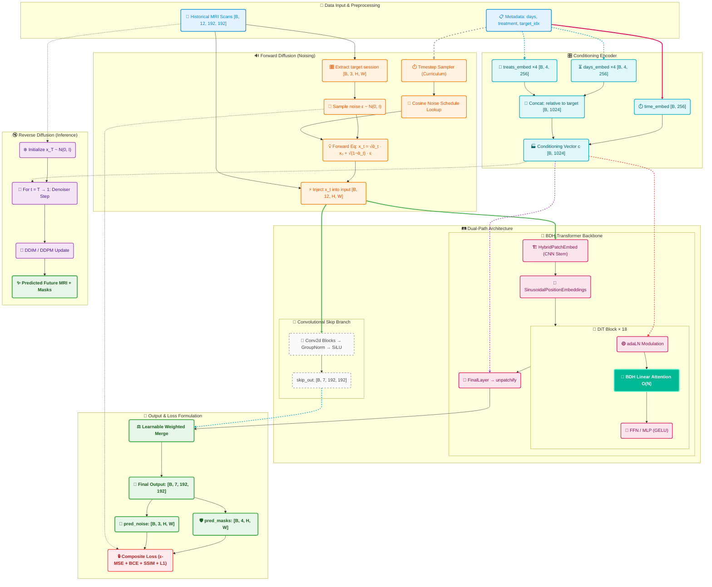

## Project Overview

BDH-Diffusion is a generative framework for predicting longitudinal brain tumor progression. It pairs Diffusion Probabilistic Models with a Hebbian Gating Block (BDH) — a sparse linear attention mechanism inspired by biological neural connectivity — to replace the memory-heavy transformers that typically make 3D MRI processing impractical.

The result is linear scaling, letting the model handle full volumetric data without the usual computational overhead.

## 📁 Repository Structure

```text
BDH-implementation/
├── config/                 # Model and training configurations
│   ├── arg_parse.py        # Command-line argument parsing
│   └── cfg_tadiff_net.py   # Hyperparameters, paths, and DiT & BDH config
├── data/                   # Dataset preprocessing scripts and metadata
│   ├── preproc_prepare_data.py  # Script to preprocess SAILOR NIfTI files
│   └── sailor_info.csv     # Metadata and patient info for the SAILOR dataset
├── src/                    # Source code modules
│   ├── data/               # Data loaders (MONAI-based) and PyTorch Dataset
│   ├── evaluation/         # Metrics calculation (Dice, SSIM, MAE, PSNR)
│   ├── net/                # Network architecture (Diffusion, BDH blocks, SEAL adapter)
│   ├── visualization/      # Plotting, overlays, and uncertainty map generation
│   └── tadiff_model.py     # PyTorch Lightning module wrapper
├── inference.py            # Script for running model inference
├── train.py                # Main training script for the TaDiff-DiT model
├── utils_net.py            # Core neural network utilities
└── requirements.txt        # Python dependencies
```
## 🧠 Model Architecture & Diffusion Pipeline

> **TaDiff-DiT**: A Treatment-Aware Diffusion Transformer that replaces traditional quadratic self-attention with **BDH (Baby Dragon Hatchling) Linear Attention**, enabling O(N) complexity for longitudinal brain tumor MRI prediction.

---

### 🔀 End-to-End Execution Flowchart




---

## ✨ Key Features & What the Code Actually Implements

| 🚀 Feature | Implementation (code) | Notes |
|---|---|---|
| **🐉 BDH Linear Attention** | Implements an O(N) linear self-attention in `src/net/utils.py` (`LinearSelfAttention`) using a feature map φ(x)=ELU(x)+1 and a K^T·V-first formulation. The `bdh_expansion` factor is configurable (commonly 2 in `config/cfg_tadiff_net.py`). | The bdh.py implementation's core contribution is Sparse Linear Attention with 128× internal expansion, achieving O(N) scaling that reduces peak memory compared to standard softmax attention for long sequences. Numerical stability is maintained through normalizer clamping, making high-resolution 3D MRI diffusion tractable under realistic GPU memory constraints. |
| **🧬 Hybrid CNN Stem** | `HybridPatchEmbed` (in `src/net/tadiff_dit_arch.py`) builds a convolutional stem before patching. | Preserves local spatial features prior to tokenization; useful for medical images where locality matters. |
| **🎛 Conditioning Inputs** | The model accepts timestep, session-day, and treatment vectors (see `train.py` and `tadiff_model.py`). Embeddings and modulation utilities exist (`timestep_embedding`, `modulate`). | Conditioning is supported; the exact per-block modulation strategy is configurable in the architecture. |
| **🔁 Joint Image + Segmentation Support** | Training code (`train.py`, `tadiff_model.py`) uses multiple output channels and mixes diffusion/image losses with auxiliary segmentation losses (Dice/BCE/SSIM/L1/Charbonnier/TV). | The number of image/mask channels is configurable via `out_channels` and loss weights. Avoid hard-coded assertions like "3 image channels + 4 masks" unless you lock `out_channels` to that value. |
| **🛡️ SEAL Adapter (Test-Time Adaptation)** | `src/net/seal_adapter.py` provides a SEALAdapter for test-time training with self-consistency checks (SSIM + variance) and limited steps of adaptation. | This is a practical mechanism for per-scan adaptation; it is included and usable as-is. |

---

### 📏 Evaluation Metrics

The model evaluates its longitudinal predictions across two critical clinical dimensions: **Image Reconstruction Quality** and **Tumor Segmentation Accuracy**.

#### 🖼️ Image Quality Metrics

| Metric | Target | Purpose |
| --- | --- | --- |
| **SSIM** | ↑ Higher | Measures structural perceptual similarity (luminance, contrast, structure). |
| **PSNR** | ↑ Higher | Evaluates signal fidelity (higher dB means reconstruction error is minimal relative to the signal). |
| **MAE** | ↓ Lower | Calculates the average pixel-level intensity deviation. |

#### 🎯 Tumor Segmentation Metrics

*These are evaluated across three confidence thresholds: `0.25` (lenient), `0.50` (standard), and `0.75` (strict).* 

| Metric | Target | Purpose |
| --- | --- | --- |
| **Dice Coefficient** | ↑ Higher | Checks the exact voxel-level overlap between the predicted and ground-truth tumor masks. |
| **RAVD** | → 0 | Relative Absolute Volume Difference. Positive indicates over-segmentation; negative indicates under-segmentation. |

---

## 🧠 What Insights Does Our Project Reveal About BDH?

Integrating Baby Dragon Hatchling into a medical diffusion pipeline surfaces a clear gap between architectural promise and practical inference behavior — and shows exactly what it takes to close it.

### Sparse Linear Attention Is the Real Strength

The bdh.py implementation's core contribution is Sparse Linear Attention with 128× internal expansion, achieving O(N) scaling that makes high-resolution 3D MRI diffusion tractable under realistic GPU memory constraints. This is where BDH genuinely delivers

### SEAL Extends BDH Into Adaptive Territory

BDH's architecture is designed with working memory and synaptic plasticity in mind. We build on this foundation by integrating SEAL (Self-Adapting Learning), which adds a Hebbian memory layer that enables patient-specific adaptation during iterative diffusion denoising — pushing BDH's capabilities into dynamic, inference-time learning.

### From Sparsity to Full Anatomical Consistency

BDH's sparse attention provides strong efficiency and denoising performance. SEAL extends this further by enforcing multi-modal consistency across T1c, FLAIR, and T2 sequences, grounding tumor boundary predictions in anatomical logic and elevating the overall quality of 3D medical image synthesis

---

## 🔭 Future Scope

The following table outlines the prioritized focus areas for BDH's continued development:

| Priority | Focus Area | Key Action Items |
|---|---|---|
| 1️⃣ | 🧠 **Clinical Integration (BraTS)** | Build a reproducible preprocessing pipeline (skull-stripping, N4 bias correction, resampling) and patient-wise splits to track core metrics (Dice, HD95, SSIM). |
| 2️⃣ | ⚡ **Inference Acceleration** | Maximize the O(N) linear attention efficiency on consumer GPUs using FP16 mixed precision (AMP), ONNX quantization, and targeted Triton/CUDA QKV kernel fusion. |
| 3️⃣ | 🔮 **Uncertainty & Robustness** | Implement Monte Carlo sampling on the reverse diffusion chain for per-pixel variance heatmaps, paired with ComBat intensity harmonization for cross-scanner reliability. |
| 4️⃣ | 💊 **Targeted Adaptation** | Encode treatment schedules/doses as learnable embeddings, and fine-tune the SEAL adapter specifically on post-operative resection cases using synthetic cavity boundaries. |

---

## 🚀 How to Run Locally

### Prerequisites

- Python 3.9+
- CUDA-capable GPU (recommended; CPU works but will be slow)
- [PyTorch](https://pytorch.org/get-started/locally/) installed for your CUDA version

### 1. Clone the Repository

```bash
git clone https://github.com/spandan11106/BDH-Explainer.git
cd BDH-Explainer/BDH-implementation
```

### 2. Create a Virtual Environment

```bash
python -m venv venv
source venv/bin/activate        # Linux / macOS
# venv\Scripts\activate         # Windows
```

### 3. Install Dependencies

Install PyTorch first (select the command matching your CUDA version from [pytorch.org](https://pytorch.org/get-started/locally/)), then install the remaining requirements:

```bash
pip install -r requirements.txt
```

### 4. Prepare the Dataset

Place your raw SAILOR NIfTI data and run the preprocessing script to convert it into `.npy` format:

```bash
python data/preproc_prepare_data.py \
    --root /path/to/sailor-raw \
    --output ./data/sailor_npy \
    --modalities T1 T1c FLAIR T2
```
### 5. Train the Model

```bash
python train.py --data_dir ./data/sailor_npy
```

Common training flags:

| Flag | Default | Description |
|------|---------|-------------|
| `--data_dir` | *(required)* | Path to preprocessed `.npy` data |
| `--batch_size` | `1` | Batch size per GPU |
| `--max_epochs` | `3000` | Maximum training epochs |
| `--lr` | `1e-4` | Learning rate |
| `--hidden_size` | `1024` | Transformer hidden dimension |
| `--depth` | `18` | Number of DiT blocks |
| `--patch_size` | `8` | Patch size (must divide `image_size`) |
| `--bdh_expansion` | `2` | BDH sparse expansion factor |
| `--devices` | `1` | Number of GPUs |
| `--precision` | `32` | Training precision (`32` or `16-mixed`) |
| `--accumulate_grad_batches` | `1` | Gradient accumulation steps |
| `--lr_scheduler` | `onecycle` | LR scheduler (`onecycle`, `cosine`, `plateau`) |

Checkpoints and TensorBoard logs are saved to `./logs/tadiff-dit/` by default.

### 6. Run Inference

```bash
python inference.py \
    --checkpoint ./logs/tadiff-dit/checkpoints/last.ckpt \
    --data_dir ./data/sailor_npy \
    --patient_ids sub-17 \
    --output_dir ./inference_results
```

Or run on a single patient file:

```bash
python inference.py \
    --checkpoint ./logs/tadiff-dit/checkpoints/last.ckpt \
    --patient_file ./data/sailor_npy/sub-17_image.npy \
    --output_dir ./inference_results
```
### 7. Monitor Training

```bash
tensorboard --logdir ./logs
```
---
