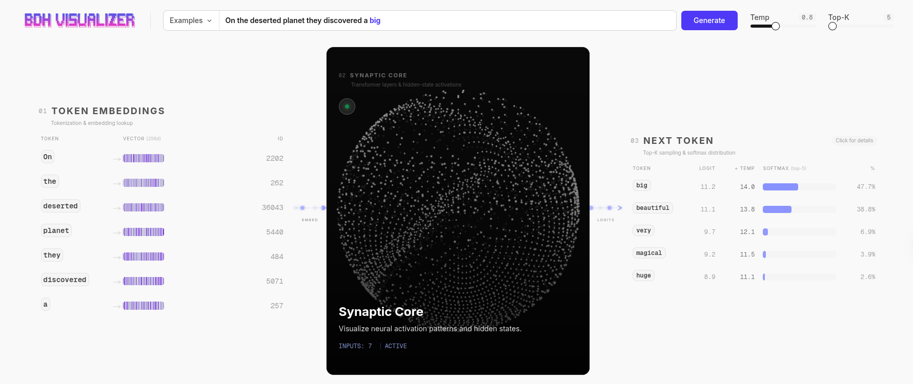

# BDH Visualizer

The BDH Visualizer is an interactive research toolkit designed for exploring model behavior and the internal representations of the Baby Dragon Hypernetwork (BDH), alongside related Transformer baselines. The architecture pairs a high-performance Python/FastAPI backend with a modern Next.js frontend, enabling deep inspection of token encodings, neuron activations, sequence generation, and sparse network topologies through 3D visualization.

[](https://bdh-explainer.vercel.app/)

<p align="center">
  
</p>


---

## Capabilities

The visualizer provides a comprehensive suite of tools for model interpretability:

*   **3D Neural Architecture Visualization:** Inspect the BDH neural network via a scale-free graph (Barabási-Albert model) rendered in three dimensions using React Three Fiber. The visualization captures wave-like activation propagation and steady-state pulsing effects to illustrate dynamic network behavior.
*   **Embedding Representation Analysis:** Deconstruct token semantics interactively. The Embedding-Synaptic core visualization breaks down token representations directly within the browser interface.
*   **Layer-Specific Neuron Activations:** Trace precise activation pathways during next-token prediction to understand functional localization within the model's layers.
*   **Architecture Comparisons:** Evaluate standard GPT-style Transformers side-by-side with the BDH Hebbian-gated architecture to observe behavioral and structural differences.

---

## Repository Layout

```text
BDH-visualizer/
├── Backend/                    # FastAPI server and PyTorch model utilities
│   ├── server.py               # API endpoints (inference, embeddings, neurons)
│   └── utils.py                # Model loader and supporting Python utilities
├── Data/                       # Data processing and prediction utilities
├── Frontend/                   # Next.js 3D web application
│   ├── app/                    # Next.js App Router structure
│   ├── components/             # React and WebGL/React Three Fiber components
│   └── lib/                    # Shared utilities and configuration
├── Models/                     # Core model implementations and training scripts
│   ├── BDH_model/              # Custom BDH architecture and inference logic
│   ├── Transformer_model/      # Standard GPT-style baseline architecture
│   └── scripts/                # Utility scripts for data extraction and analysis
├── environment.yml             # Conda environment definition
├── requirements.txt            # Python package dependencies
├── setup_environment.sh        # Automated environment configuration script
└── start_server.sh             # FastAPI launch script
```

---

## Quick Start Guide

### Prerequisites

*   **Python:** 3.8+ (3.10 recommended)
*   **Node.js:** 16+
*   **Environment Management:** Conda (Recommended)

### 1. Environment Configuration

It is recommended to utilize the provided bash script to configure the required Conda environment:

```bash
chmod +x setup_environment.sh
./setup_environment.sh
conda activate ml
```

*(Alternatively, standard virtual environments can be used with `pip install -r requirements.txt`.)*

### 2. Launching the Backend

The backend provisions model inferences, logits, and structural data via RESTful endpoints.

```bash
python -m uvicorn Backend.server:app --host 0.0.0.0 --port 8000 --reload
# Alternatively, use the included shell script: ./start_server.sh
```
*The backend API will be accessible at `http://localhost:8000`.*

### 3. Launching the Frontend Application

The Next.js application serves the interactive visualizations.

```bash
cd Frontend
npm install
npm run dev
```
*The web interface will be accessible at `http://localhost:3000`.*

---

## Configuration

Paths for datasets and model checkpoints resolve relative to the project root by default. These can be overridden using the following environment variables:

| Environment Variable | Description |
|---|---|
| `BDH_DATA_DIR` | Directory containing the tokenized binaries (`train.bin`, `val.bin`). |
| `BDH_OUT_DIR` | Directory storing the compiled PyTorch checkpoints (`.pt` files). |

**Configuration Example:**
```bash
export BDH_DATA_DIR=/dataset/tinystories
export BDH_OUT_DIR=/checkpoints/bdh-v1
```

---

## Command Line Interface Utilities

Several command-line tools are included for offline dataset analysis and batch processing.

**Execute Next-Token Prediction:**
```bash
python Data/next_token.py "Once upon a time"
```

**Run an Isolated Inference Session:**
```bash
cd Models/BDH_model
python run.py
```

**Generate Activation Analysis Datasets:**
```bash
chmod +x run_activation_analysis.sh
./run_activation_analysis.sh
```

---

## Developer Architecture Notes

*   **Hardware Requirements:** For model training and executing deep analysis scripts, an NVIDIA GPU with a minimum of 8GB VRAM is advised. While the backend API operates efficiently on CPU for standard inference, GPU acceleration is highly recommended for embedding extraction and visualization processing.
*   **Tokenization Pipeline:** The project utilizes OpenAI's `tiktoken` to follow standard GPT-2 tokenization conventions. Ensure it is available within your environment.
*   **Checkpoint Parsing:** The data pipeline expects model weights to follow the naming convention `ckpt_<iter>.pt` or `<model>_final.pt`.
*   **Frontend Rendering Logic:** The 3D visualization employs scaled Barabási-Albert model logic to govern node connectivity. Physics parameters including node gravity and repulsion forces are defined within the React Three Fiber canvas implementations located under `Frontend/components/`.

---

## Contributing

Contributions to the codebase, including logic optimizations and front-end refinements, are welcome. When submitting a pull request, please ensure adherence to the existing structural conventions. Issue reports regarding 3D WebGL performance or FastAPI data handlers should be logged via the repository's issue tracker.

---

## License

This project is licensed under the MIT License

