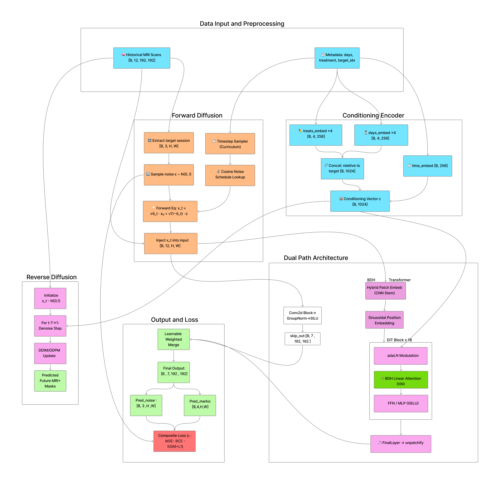

# BDH-Explainer

[](https://www.youtube.com/playlist?list=PLS6rVTBBmT8sIcPJ8fPWlKRXvMj_fHq6G)
[](https://bdh-explainer.vercel.app/)

## Table of Contents

- [What We Built](#what-we-built)
- [What Insight It Reveals About BDH](#what-insight-it-reveals-about-bdh)
- [Project Structure](#project-structure)
- [How to Access the Hosted Demo](#how-to-access-the-hosted-demo)
- [How to Run Locally](#how-to-run-locally)
- [Video Demo and Images](#video-demo-and-images)
- [Team Members and Contributions](#team-members-and-contributions)
- [Limitations and Future Scope](#limitations-and-future-scope)
- [License](#license)


## What We Built

BDH-Explainer is a three-part project that implements, visualizes, and teaches the Baby Dragon Hatchling (BDH) architecture — a biologically inspired alternative to standard Transformer attention. The **BDH-implementation** component applies BDH linear attention to a medical diffusion model (Bdh-DiT) that predicts longitudinal brain tumor progression from MRI slices, using treatment-aware conditioning and joint image-segmentation generation. The **BDH-visualizer** is an interactive Next.js + Three.js web application backed by a FastAPI server that lets users explore BDH internals — neuron activations, token embeddings with RoPE transformations, and next-token prediction distributions — through 3D visualizations in real time. The **Understanding BDH** component is a six-part YouTube tutorial series with accompanying slides that walks through the original research paper section by section.

---

## What Insight It Reveals About BDH

Integrating BDH into a medical diffusion pipeline surfaces a clear gap between architectural promise and practical inference behavior — and shows exactly what it takes to close it:

- **Sparse linear attention is the real strength.** The BDH blocks reduce memory growth from O(N^2) to O(N) relative to standard softmax attention by using an ELU+1 feature map with a K^T*V-first formulation, making it practical for high-resolution medical imaging on consumer GPUs.
- **From sparsity to full anatomical consistency.** BDH attention improves efficiency, while the SEAL adapter adds adaptive robustness. Together, they improve practical inference behavior on longitudinal multi-modal MRI slices — the visualizer makes this visible by letting users inspect exactly which neurons activate and how embeddings shift under different inputs.
- **Biological plausibility has engineering payoffs.** The fixed-size state matrix and ~5% activation sparsity that BDH borrows from neuroscience translate directly into constant  memory footprint and linear scaling, validated both by our implementation benchmarks and the interactive visualizer.

---

## Project Structure

```
BDH-Explainer/
├── BDH-implementation/    # Medical diffusion model with BDH linear attention
│   ├── train.py           # Training script for the Bdh-DiT model
│   ├── inference.py       # Inference on patient MRI data
│   ├── src/               # Network architecture, data loaders, evaluation, visualization
│   ├── config/            # Hyperparameters and argument parsing
│   ├── data/              # Preprocessing scripts and SAILOR dataset metadata
│   └── requirements.txt
├── BDH-visualizer/        # Interactive 3D visualization web app
│   ├── Frontend/          # Next.js + React + Three.js + Tailwind CSS
│   ├── Backend/           # FastAPI server for model inference and state extraction
│   └── Data/              # Extraction scripts for neurons, embeddings, predictions
└── Understanding BDH/     # Six-part YouTube tutorial series and slides
```

---

## How to Access the Hosted Demo

The interactive visualizer is deployed and accessible at:

<!-- Prominent demo button -->
<p align="center">
    <a href="https://bdh-explainer.vercel.app/" target="_blank">
        
    </a>
</p>

---

## How to Run Locally

### BDH-Implementation (Medical Diffusion Model)

#### Prerequisites
- Python 3.9+
- CUDA-capable GPU recommended (8 GB VRAM minimum for inference, 24 GB for training)
- 16 GB RAM minimum (32 GB recommended)

#### Setup

```bash
git clone https://github.com/spandan11106/BDH-Explainer.git
cd BDH-Explainer/BDH-implementation

python -m venv venv
source venv/bin/activate        # Linux / macOS
pip install -r requirements.txt
```

#### Download Required Files

Large model files are hosted on Google Drive. Download and place them before running:

| File | Download Link | Destination |
|:-----|:--------------|:------------|
| `logs` (trained weights) | [Download](https://drive.google.com/drive/folders/1Ep1H8V7LfOQjbx2kZQ5SccMCER4gNvJ7) | `BDH-implementation/` |
| `inference_npy` | [Download](https://drive.google.com/drive/folders/1ySYWy8tMg8TSjOmhA30yQIX0v0ZIW9md) | `BDH-implementation/data/` |
| `sailor_npy` (training data) | [Download](https://drive.google.com/drive/folders/1CYIztxcB2ApVmGQOfrpTVJwIFmITpzML) | `BDH-implementation/data/` |

#### Train

```bash
python train.py --data_dir ./data/sailor_npy
```

#### Inference

```bash
python inference.py \
    --checkpoint ./logs/bdh-net/checkpoints/last.ckpt \
    --data_dir ./data/inference_npy \
    --patient_ids sub-03 sub-04 \
    --output_dir ./inference_results
```

#### Monitor Training

```bash
tensorboard --logdir ./logs
```

### BDH-Visualizer (Interactive Web App)

#### Backend

```bash
cd BDH-Explainer/BDH-visualizer

# Create and activate the Conda environment
conda env create -f environment.yml
conda activate ml

# Run the data extraction pipeline
cd Data
./run_demo.sh

# Start the FastAPI server
cd ..
python -m uvicorn Backend.server:app --host 0.0.0.0 --port 8000 --reload
```

API docs available at `http://localhost:8000/docs`.

#### Frontend

```bash
cd BDH-Explainer/BDH-visualizer/Frontend

npm install
npm run dev
```

Open `http://localhost:3000` in your browser.

---

## Video Demo and Images

### Demo Videos

You can watch the three go-through demos here:

 - BDH implementation demo: [Watch BDH implementation demo](https://youtu.be/kEowGahk7eI?si=gF2o20hoZTs_3ll8)
 - BDH visualization demo: [Watch BDH visualization demo](https://youtu.be/m2QtAjVr-Kg?si=RJ6-yuR2XIyCgZ8M)
 - BDH understanding demo: [Watch BDH understanding demo](https://youtu.be/0HZgI4Nn_6E?si=aWVA5lLbwk_xjlQK)

### Images

- BDH implementation architecture:

    

- BDH visualizer interface:

    

## Team Members and Contributions

| Component | Members | Work |
|:----------|:--------|:-----|
| **BDH Visualization** | Spandan, Paras | Built the interactive Next.js + Three.js web visualizer with 3D neuron activations, token embedding explorer, and real-time next-token prediction. Developed the FastAPI backend, data extraction pipeline, and deployed the hosted demo. |
| **BDH Implementation** | Nishant, Soham, Preyash | Implemented BDH linear attention inside the medical diffusion model (Bdh-DiT). Developed training and inference pipelines, integrated the SEAL adapter and evaluation metrics, and prepared preprocessing scripts and model checkpoints. |
| **BDH Understanding** | Ujjwal, Sanchit, Prakhar | Produced the six-part YouTube tutorial series with accompanying slides. Authored step-by-step walkthroughs of the BDH architecture, math, design choices, limitations, and future directions. |
---

## Limitations and Future Scope

### Current Limitations
- The model operates on **2D MRI slices** rather than full 3D volumes in a single forward pass
- Training requires a **24 GB VRAM GPU** at minimum for the default architecture
- Model checkpoints and preprocessed data must be downloaded separately due to GitHub file size limits
- The visualizer backend requires local model weights for accurate results (falls back to random initialization otherwise)

### Future Scope

| Priority | Focus Area | Key Action Items | Impact |
|:---------|:-----------|:-----------------|:-------|
| 1 | **Clinical Integration (BraTS)** | Build a reproducible preprocessing pipeline (skull-stripping, N4 bias correction, resampling) with patient-wise splits | Standardized data prevents learning scanner artifacts |
| 2 | **Inference Acceleration** | FP16 mixed precision (AMP), ONNX quantization, and targeted Triton/CUDA kernel fusion | Enables deployment on standard hospital GPUs |
| 3 | **Uncertainty & Robustness** | Monte Carlo sampling for per-pixel variance heatmaps, ComBat intensity harmonization | Uncertainty heatmaps flag ambiguous regions for clinicians |
| 4 | **Targeted Adaptation** | Encode treatment schedules/doses as learnable embeddings, fine-tune SEAL on post-operative cases | Predict treatment trajectories and handle surgical cavities |

---

## License

See [LICENSE](LICENSE) for details.
